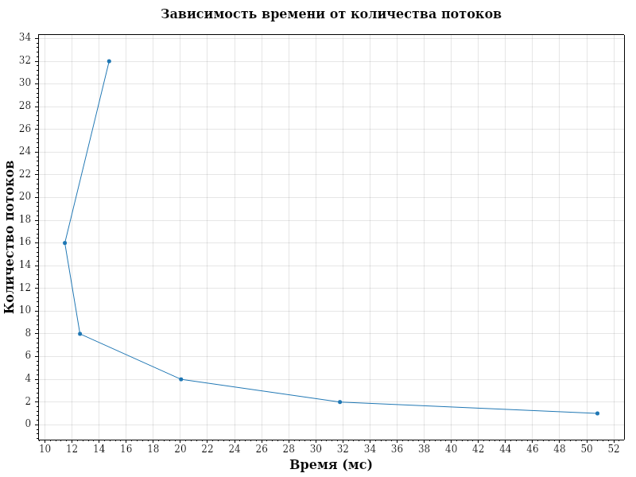

# Задача 15. Определение оптимальных параметров алгоритма вычисления определенного интеграла

Функция: sin(x), отрезок [-100, 100].
Точный результат: 0 (синус — нечётная функция).

## 1. Оптимальный шаг для вычислений: 1e-4

Это минимальный шаг, обеспечивающий точность 1e-4. Его выбор основан на тесте:

    Шаг: 0.1,    Погрешность: 0.036,      Время: 1 миллисекунд
    Шаг: 0.01,   Погрешность: 0.0025,     Время: 1 миллисекунд
    Шаг: 0.001,  Погрешность: 0.000245,   Время: 6 миллисекунд
    Шаг: 0.0001, Погрешность: 0.0000507,  Время: 47 миллисекунд
    Шаг: 1e-5,   Погрешность: 0.00000506, Время: 233 миллисекунд
    Шаг: 1e-6,   Погрешность: 0.00000004, Время: 2048 миллисекунд

На основе теста был сделан вывод о том, что шаг 1e-4 — первый, дающий нужную точность, и самый быстрый из подходящих.

## 2. Оптимальное количество потоков для вычислений: 16

Замеры проводились 500 раз для каждого варианта, чтобы получить средний результат.

    Потоков: 1,  Среднее время: 51.8 миллисекунд
    Потоков: 2,  Среднее время: 31.8 миллисекунд
    Потоков: 4,  Среднее время: 19.3 миллисекунд
    Потоков: 8,  Среднее время: 12.4 миллисекунд
    Потоков: 16, Среднее время: 11.3 миллисекунд
    Потоков: 32, Среднее время: 14.9 миллисекунд

Лучший результат был на 16-ти потоках (11.3 миллисекунд).
Это может быть связано с характеристиками вычислительной техники: 8 ядер, 16 логических процессоров.
Каждый логический процессор получает свой поток, что обеспечивает максимальную параллельность.

## 3. Сравнение многопоточной и однопоточной реализации

    Лучший многопоточный вариант (16 потоков): 11.3 миллисекунд
    Среднее время однопоточного варианта: 46.1 миллисекунд
    Многопоточный вариант быстрее на 75.5%.

Разница превышает требуемые 15%, поэтому оптимизация многопоточной версии не требуется.

